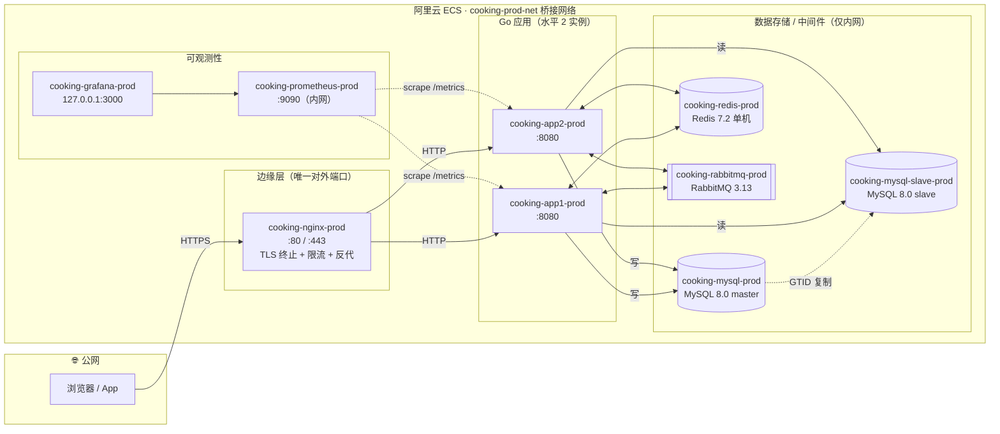
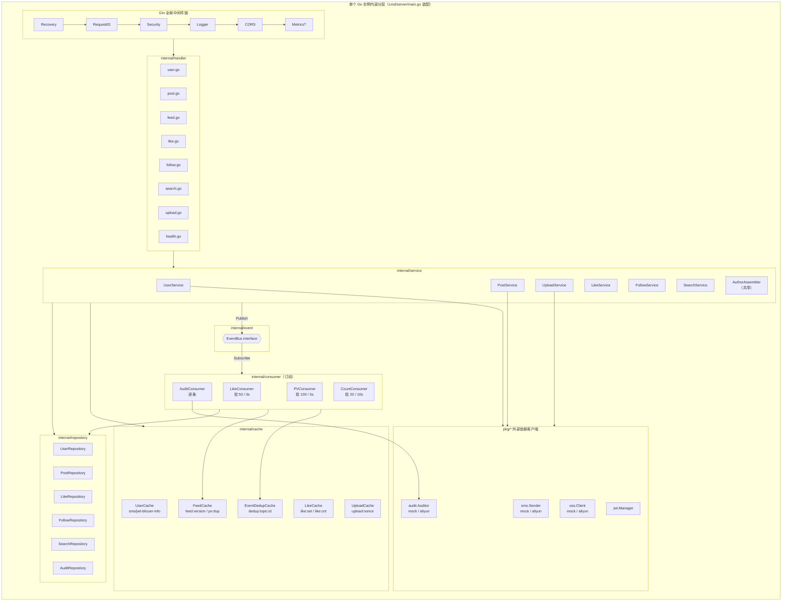
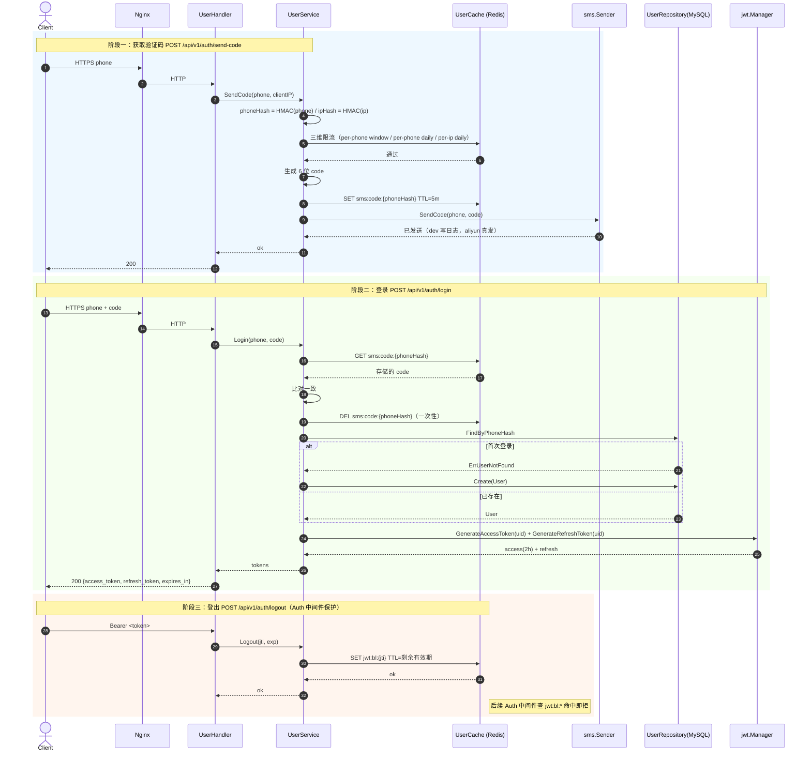
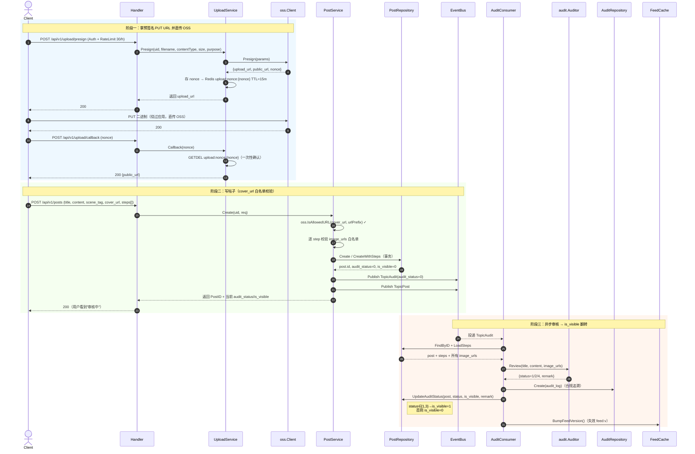
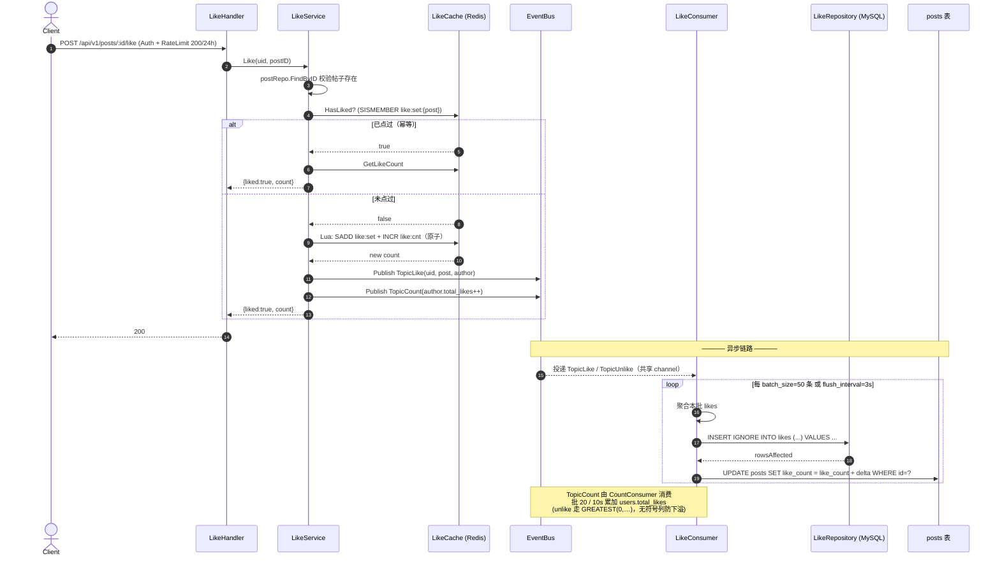
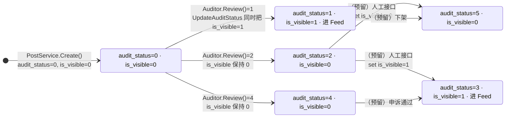
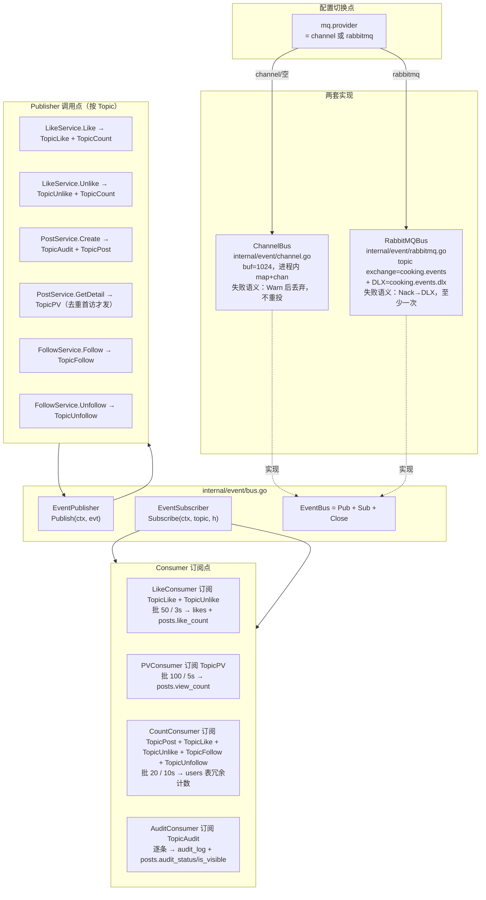
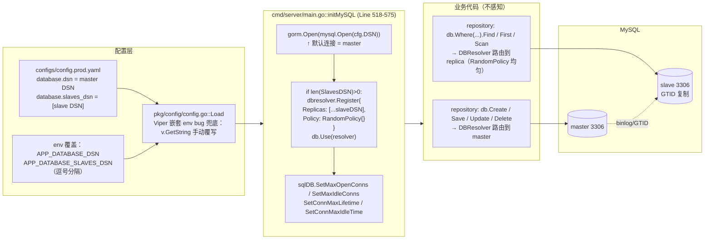

# cooking-platform 架构讲解（面试用）

> 本文档所有 Mermaid 图都基于代码事实，不基于 PRD 或回顾文档的描述。
> 每张图都列出对应的代码位置索引，方便对照阅读。
> 末尾一节"与代码不一致的发现"记录了与常见预期/PROJECT_RETROSPECTIVE 描述存在出入的地方。
>
> 生成日期：2026-05-21（项目收官后维护期）

---

## 0. 探索总览（一句话事实表）

| 维度 | 真实情况 |
| --- | --- |
| 入口 main 包 | `cmd/server/main.go`（HTTP 服务）+ `cmd/migrate-phone/main.go`（一次性脚本） |
| Handler 模块 | user / post / feed / like / follow / search / upload / health（共 8 个文件） |
| Service 模块 | user / post / like / follow / search / upload + AuthorAssembler 共享层 |
| Consumer | LikeConsumer / PVConsumer / CountConsumer / AuditConsumer（共 4 个） |
| EventBus 实现 | ChannelBus（进程内）+ RabbitMQBus（生产），都活在代码里，通过 `mq.provider` 切换 |
| 可换外部依赖 | `pkg/sms` / `pkg/audit` / `pkg/oss` 三件套，每个有 interface + mock + aliyun 三个文件 |
| MySQL 读写分离 | GORM DBResolver + RandomPolicy，仅当 `database.slaves_dsn` 非空时注册 |
| Redis | 单机 client（非 Sentinel），通过 `redis.addr/password/db` 注入 |
| Prod 容器 | nginx / app1 / app2 / mysql / mysql-slave / mysql-slave-init / redis / rabbitmq / prometheus / grafana |
| 仅 80/443 公网 | Grafana 绑 `127.0.0.1:3000`，其他后端组件 0 host port |

---

## 1. 整体架构图

这张图回答："一个请求从公网进来，会经过哪些容器、哪些应用内层级，最终落到哪些存储？" 容器层（左）和应用内分层（右）分开展示，箭头方向是真实调用方向。

**关键代码位置索引**

| 内容 | 文件:位置 |
| --- | --- |
| Boot 主流程（21 步） | `cmd/server/main.go:74-330` |
| 全局中间件注册顺序 | `cmd/server/main.go:376-388`（Recovery→RequestID→Security→Logger→CORS→Metrics） |
| Gin 路由装配 `setupRouter()` | `cmd/server/main.go:361-510` |
| MySQL + DBResolver 初始化 | `cmd/server/main.go:518-575` |
| Redis 初始化 | `cmd/server/main.go:578-596` |
| EventBus 工厂（mq.provider 分支） | `cmd/server/main.go:598-611` |
| Consumer 注册 | `cmd/server/main.go:199-202` |
| 三阶段优雅关停 | `cmd/server/main.go:268-330` |
| Docker prod 拓扑（含 networks/ports） | `docker-compose.prod.yml:27-313` |
| 仅 nginx 暴露 80/443 | `docker-compose.prod.yml:231-238` |
| Grafana 绑 127.0.0.1:3000 | `docker-compose.prod.yml:281-282` |

---

## 2. 核心请求时序图

### 2.1 用户注册/登录（短信验证码 + JWT）

这张图回答："登录是 stateless 的吗？验证码怎么防刷？JWT 在哪里发？登出怎么实现？" 注意：不存在传统 session 表，登录用 JWT，登出用 Redis 黑名单。

**关键代码位置索引**

| 内容 | 文件:位置 |
| --- | --- |
| 路由注册 `/auth/send-code` `/auth/login` `/auth/logout` | `cmd/server/main.go:407-410` |
| `UserHandler.SendCode / Login / Logout` | `internal/handler/user.go` |
| `UserService` 结构与构造 | `internal/service/user_service.go:42-82` |
| 三维 SMS 限流方法 | `internal/cache/user_cache.go`：`CheckAndConsumeSMSWindow / CheckAndConsumePerPhoneDaily / CheckAndConsumePerIPDaily` |
| 验证码 Key 设计 `sms:code:{phoneHash}` | `internal/cache/user_cache.go` |
| JWT 发放与黑名单 | `pkg/jwt/manager.go`；黑名单 Key `jwt:bl:{jti}` 在 `user_cache.go` |
| phone 字段加密 | `pkg/crypto`（AES-256-GCM）+ `cmd/migrate-phone/main.go` 一次性迁移 |

---

### 2.2 发帖流程（OSS 预签名 → 异步审核 → is_visible 翻转）

这张图回答："图片是怎么直传 OSS 不过应用？发帖瞬间为什么不可见？审核结果如何把帖子推上 Feed？" 注意：发帖瞬间 `audit_status=0, is_visible=0`；审核结果在 AuditConsumer 里写回。

**关键代码位置索引**

| 内容 | 文件:位置 |
| --- | --- |
| 路由 `/upload/presign` `/upload/callback` `/posts` | `cmd/server/main.go:436-506` |
| `UploadService.Presign / Callback` | `internal/service/upload_service.go:46-63` 起 |
| OSS 客户端 interface + 实现 | `pkg/oss/client.go`、`pkg/oss/mock.go`、`pkg/oss/aliyun.go` |
| OSS URL 白名单校验 | `pkg/oss/whitelist.go::IsAllowedURL` |
| `PostService.Create`（含 cover/step URL 校验） | `internal/service/post_service.go:98` 起 |
| `publishAuditEvent` | `internal/service/post_service.go:478-` |
| `publishPostEvent` | `internal/service/post_service.go:325-345` |
| `AuditConsumer.Start / process` | `internal/consumer/audit_consumer.go:95-200+` |
| `is_visible` 由 `result.Status` 推导 | `internal/consumer/audit_consumer.go:164-168` |
| `BumpFeedVersion` | `internal/cache/feed_cache.go` |

---

### 2.3 点赞流程（Redis 即时 → 批量落库）

这张图回答："为什么点赞看着秒响应却没立刻写库？掉电了点赞会丢吗？" 答：Redis 是真源（短时）+ EventBus + LikeConsumer 批处理（50 条 / 3s）合并落 MySQL。

**关键代码位置索引**

| 内容 | 文件:位置 |
| --- | --- |
| 路由 `/posts/:id/like` | `cmd/server/main.go:448-464` |
| `LikeHandler.Like / Unlike / GetLikeStatus` | `internal/handler/like.go` |
| `LikeService` 结构 | `internal/service/like_service.go:72-95` |
| `LikeCache.AddLike / RemoveLike`（Lua 原子） | `internal/cache/like_cache.go` |
| `LikeConsumer` 批处理参数 | `internal/consumer/like_consumer.go`，config key `consumer.like.batch_size` / `flush_interval` |
| `INSERT IGNORE` 幂等 | `internal/repository/like_repository.go::BatchInsert` |
| `CountConsumer` 处理 5 个 Topic | `internal/consumer/count_consumer.go:120-` |

---

## 3. 内容审核状态机

这张图回答："`audit_status` 这个字段有几种取值？谁能让它流转？流到哪些值会让帖子真正对公众可见？" 注意：人工通道（3/5）在代码层有枚举位但**目前没有 Admin 接口实现**——见末节"与代码不一致的发现"。

**关键代码位置索引**

| 内容 | 文件:位置 |
| --- | --- |
| 状态常量定义 | `internal/model/post.go:65-77`（`AuditStatusPending=0 / MachinePass=1 / Suspect=2 / ManualPass=3 / MachineDeny=4 / ManualDeny=5`） |
| `is_visible` 常量 | `internal/model/post.go:81-84` |
| 初值落地 `audit_status=0,is_visible=0` | `internal/service/post_service.go::Create`（写库时使用 model 默认） |
| 机审入口 | `internal/consumer/audit_consumer.go:98-117` Subscribe |
| 调用 audit Provider | `internal/consumer/audit_consumer.go:147-162` |
| `is_visible` 由 `result.Status` 推导 | `internal/consumer/audit_consumer.go:164-168`（仅当 status==MachinePass 才置 1） |
| 持久化结果 | `internal/repository/audit_repository.go::Create` + `internal/repository/post_repository.go::UpdateAuditStatus` |
| Feed 仅取 `is_visible=1` | `internal/repository/post_repository.go::List*`（WHERE is_visible=1） |

---

## 4. EventBus 抽象图

这张图回答："Channel 模式和 RabbitMQ 模式怎么切？哪些 Service 在 publish？哪些 Consumer 在订阅？两种实现行为差异在哪？"

**关键代码位置索引**

| 内容 | 文件:位置 |
| --- | --- |
| 接口定义 + 失败语义对照表（必看注释） | `internal/event/bus.go:1-68` |
| ChannelBus（进程内、buf=1024、丢弃语义） | `internal/event/channel.go` |
| RabbitMQBus（topic exchange + DLX + 重连退避） | `internal/event/rabbitmq.go` |
| Topic 字符串常量与 Payload 结构体 | `internal/event/types.go:9-123` |
| 工厂分支 `initEventBus()` | `cmd/server/main.go:598-611` |
| Publisher 调用点 1：`LikeService.Like/Unlike` | `internal/service/like_service.go`（~Line 238/266） |
| Publisher 调用点 2：`PostService.publishAuditEvent` / `publishPostEvent` / `recordPV` | `internal/service/post_service.go:325-396, 478-` |
| Publisher 调用点 3：`FollowService.Follow/Unfollow` | `internal/service/follow_service.go`（~Line 260/296） |
| Subscriber 注册：4 个 Consumer 在 `consumer.Manager` 中启动 | `cmd/server/main.go:199-202` + `internal/consumer/manager.go` |
| 幂等保障：`EventDedupCache` | `internal/cache/event_dedup_cache.go` |

---

## 5. MySQL 读写分离路由图

这张图回答："读写分离是怎么实现的？SELECT 真的会去 slave 吗？业务代码需要感知吗？" 答：基于 GORM DBResolver + RandomPolicy，业务代码零感知；仅当 `database.slaves_dsn` 非空才注册插件，**未发现任何 `Clauses(dbresolver.Write)` 强制走主的代码**。

**关键代码位置索引**

| 内容 | 文件:位置 |
| --- | --- |
| DSN 配置项与默认 | `configs/config.yaml`（dev）/ `configs/config.prod.yaml`（生产） |
| Env 注入与 Viper 嵌套 env bug 兜底 | `pkg/config/config.go:255-316`，注释明确说明 GetString 兜底 |
| DBResolver 注册（含条件分支） | `cmd/server/main.go:540-556` |
| RandomPolicy 选择 | `cmd/server/main.go:547`（`dbresolver.RandomPolicy{}`） |
| 连接池设置（master + replica 链式） | `cmd/server/main.go:548-552` + `563-566` |
| 业务代码无 `Clauses(Write)` 显式强制 | 全仓 grep 未命中（核实方式：`grep -RIn 'dbresolver.Write\|Clauses(dbresolver' internal/`） |
| 主从复制初始化（Docker 层） | `docker-compose.prod.yml:77-98` + `deploy/mysql/init-slave.sh` |

---

## 6. 与代码不一致的发现（诚实清单）

如下是探索过程中发现的、与"常见模式"或 PROJECT_RETROSPECTIVE / PRD 描述存在**实际差异**的点。这些不是 bug，只是讲故事时要注意别说错话。

1. **`CountEvent` / `TopicCount` 在代码里是"死信号"。**
   - 类型在 `internal/event/types.go:74-82` 定义，常量在 `types.go:14`。
   - 但全仓没有任何地方 `Publish` 这个 Topic，也没有 Consumer 订阅它。
   - 真正驱动 `users` 表冗余计数的，是 **CountConsumer 直接订阅 5 个业务 Topic**（`TopicPost / TopicLike / TopicUnlike / TopicFollow / TopicUnfollow`）后自己折算 delta，不走 `TopicCount`。
   - 影响：讲"计数事件"时不要画成"业务 → TopicCount → CountConsumer"，那是错的。

2. **CLAUDE.md §3 写"Redis 7.2 Sentinel 模式"，但代码是单机 Client。**
   - `cmd/server/main.go:578-596` 用的是 `goredis.NewClient(&Options{Addr:..., Password:...})`，没有用 `NewFailoverClient` 或 Sentinel 相关 API。
   - 配置文件也只有 `redis.addr` 单地址字段。
   - 影响：讲"Redis 高可用"时要明确——目前是**单实例 + AOF**，HA 是遗留债务，不要按 Sentinel 描述。

3. **`audit_status` 的人工分支（3 / 5）枚举位有，但没有 Admin API。**
   - 常量 `AuditStatusManualPass=3 / ManualDeny=5` 在 `internal/model/post.go:74,76` 已定义。
   - 但 `internal/handler/` 下没有任何 admin/audit 路由；`AuditConsumer.process` 也只产出 1/2/4 三种状态（见 `audit_consumer.go:164-168`）。
   - 影响：状态机图里我把人工分支标成"预留"——意思是字段层支持、流程层未接通。讲架构时建议这么定性。

4. **"Step 18 IDEMP-01" 的 EventDedupCache 实际生效面有限。**
   - 它注入到了 `CountConsumer` 和 `PVConsumer`（见 `cmd/server/main.go:193-202` 的构造参数），但 **LikeConsumer 和 AuditConsumer 没用** EventDedupCache 做去重。
   - LikeConsumer 靠 `INSERT IGNORE`（DB 层唯一键）保证幂等；AuditConsumer 靠"非 pending 状态直接跳过"软去重（`audit_consumer.go:111-113`）。
   - 影响：讲"通用幂等"时不要说"所有 Consumer 都用 EventDedupCache"——是按消费者特性挑的。

5. **审核失败时不写 audit_log 行的兜底是"继续往下走"。**
   - `audit_consumer.go:180-186`：若 `auditRepo.Create` 失败，**不 return**，仍会去 `UpdateAuditStatus` 更新 posts，避免帖子卡在 pending。
   - 影响：合规追溯并非 100% 强一致——audit_log 缺一行的极端场景存在。讲合规时要诚实承认这是"posts 状态优先于审计日志"的取舍。

6. **`cmd/migrate-phone` 是历史一次性脚本，不是常驻入口。**
   - 它是 Step 11 phone 字段加密迁移工具（明文 → AES-256-GCM）。
   - 当前生产数据应已全部迁完，这个 main 包保留只是为了文档可重现。
   - 影响：讲"服务有 2 个 main"在事实上正确，但要标注一个是 one-shot。

7. **Service 层并不全部依赖 EventBus。**
   - `UserService` / `SearchService` / `UploadService` 的构造函数里**没有** `event.EventPublisher` 参数（见各自 `NewXxxService` 签名）。
   - 只有 `PostService / LikeService / FollowService` 真正 publish。
   - 影响：画分层图时不要给所有 Service 都连一条"→ EventBus"的箭头，会失真。我在 §1 的内部分层图里已经只让 S→EB 一条粗线收口、不分子箭头，避免误导。

---

> 以上所有断言都可通过本文档列出的"代码位置索引"行号直接对照验证。
> 若代码后续演进与本文出现新的不一致，建议把变更同时反映到这里——本文档是面试讲解的事实底稿。
